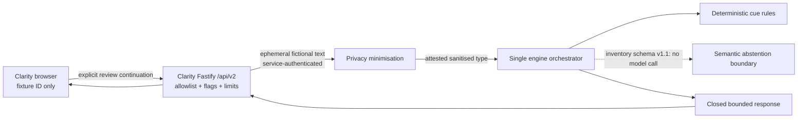

# Clarity / Communication Signal Engine boundary

Status: local synthetic review architecture only
Owner: Keith Grehan
Reviewed: 2026-07-15

## Product boundary

- **Clarity** is the client product and owns the browser flow, task selection, consent state, feature flags, request limits and session clearing.
- **Communication Signal Engine** is a private development service that minimises identifiers and returns bounded wording or structure observations. Its supported launcher validates and binds loopback; a different ASGI launcher can bypass bind metadata, so the service secret remains mandatory.
- **Vibe Signal** remains a separate product and donor. Clarity exposes no Vibe-branded mode or shared history.
- Internal presentation profiles are task-oriented: `structure_support` and `wording_support`. They are not diagnoses, identities, personality categories or inferred neurotypes.

Clarity sends no diagnosis, compatibility data, attraction data, profile history, relationship score, hidden user state or client-supplied user identity to the engine. The initial route accepts only server-resolved fictional fixtures. The browser never sends transcript text.

## Allowed local flow

The service response is `Cache-Control: no-store` and contains no input, sanitised text, quotations, evidence snippets, model paths, person-level confidence, diagnosis, emotion, attraction, compatibility or relationship prediction. It may contain at most three registered cue observations, optional sanitised-coordinate ranges, and at most one editable repair action. Low-signal or abstaining results contain no repair action.

## Trust boundaries

| Boundary | Enforced condition | Failure behavior |
|---|---|---|
| Browser → Fastify | Feature flag, fixture allowlist, exact request schema, explicit review continuation, size/rate limit | Generic denial; no downstream call |
| Fastify → Python | Loopback URL, strong header secret, exact request/response schema, synthetic provenance | Generic denial; no body or header logging |
| Raw text → engine | Identifier minimisation completes and the resulting opaque type is attested | Text analysis refuses; no partial result |
| Deterministic → semantic | Sanitised type only; exact inventory; offline flags; inventory schema v1.1 prohibits model execution | Semantic abstains without importing or calling a model; deterministic path may continue |
| Audio research | Separate modules and optional dependency only | No import or route from text service |

Deterministic identifier patterns run before the optional local NER detector, followed by a narrower residual-pattern check. This layered pass is risk reduction, not proof of anonymity. Privacy receipts report categories and counts of potential identifiers handled and name whether local spaCy, a synthetic test double, or fictional-fixture pattern checks actually ran.

## Data lifecycle

Fixture text exists in tracked, fictional Fastify source and in one request's memory. The engine does not persist raw or sanitised text, request bodies, prompts, embeddings, acoustic arrays or output history. The browser keeps the current synthetic result in memory. Clear Session aborts the active request, invalidates late completions and removes the displayed result and edit; this is an application-memory statement, not a physical-erasure claim. No result is written to URLs, browser storage, analytics or notifications.

## Explicit exclusions

- No user-authored text, received-message upload, public upload, audio upload or production endpoint.
- No training, fine-tuning, service-to-training reuse, scraped-content corpus or participant-derived example.
- No emotion, cognitive state, neurotype, confidence, deception, attraction, compatibility or relationship-quality inference.
- No cross-dialect quality score. Language tags only select documented rule coverage and unsupported tags fail closed.
- No secure-erasure claim. The isolated audio research utility can unlink an intake path; storage-layer persistence is outside that operation's guarantee.

Every broader path is governed by `docs/control_room/SIGNAL_ENGINE_GATES.md` and remains disabled until evidence and an owner decision are recorded.

## Disabled T1 readiness boundary

D020 permits separate v2 prepare, continue and clear contracts for fictional protocol/security tests. Fastify remains the sole product identity and consent boundary. It stores only a hashed public token, subject plus exact policy/notice/effective-consent binding and opaque internal nonce. Python receives no subject identity, diagnosis, matching profile or research context; it stores minimized text only under the unrelated nonce for the bounded review window. Timer-driven expiry removes idle state, and in-flight clear/withdrawal revokes the Python lease while Fastify suppresses any late release.

The environment parser keeps real user-authored text prohibited. Tests may inject explicitly named test-only identity, consent and privacy dependencies only in a test environment. Without an approved local privacy model, non-test prepare refuses. Passing these tests does not pass SG1 or authorize a public route.
