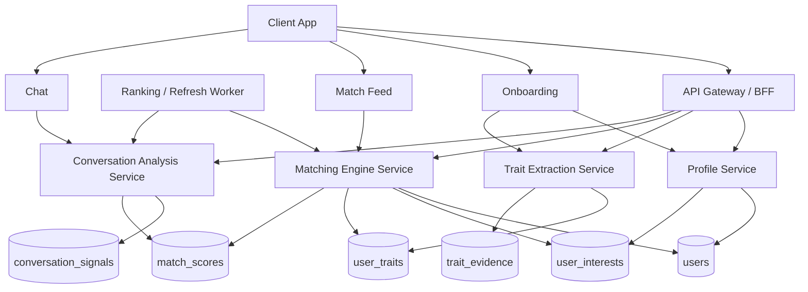

# Clarity Matching Engine — System Architecture + Data Flow

## Overview

This architecture is designed for a **rules-first, explainable matching engine** with NLP-assisted trait extraction and conversation refinement.

### Core principles
- Matching is based on **interaction compatibility**, not only attraction or swipes.
- NLP is used to **extract and refine traits**, not to make opaque clinical judgments.
- Scoring remains **interpretable and auditable**.
- The system improves after **observed conversation behavior**.

---

## High-level components

1. **Client App / Admin**
   - onboarding
   - profile editing
   - match list
   - conversation UI
   - match explanation UI

2. **Profile Service**
   - stores base profile
   - stores preferences and hard filters
   - stores structured answers

3. **Trait Extraction Service**
   - parses free text
   - suggests editable traits
   - writes traits with source + confidence

4. **Matching Engine**
   - hard gates
   - sub-score calculation
   - friction detection
   - final score + explanation generation

5. **Conversation Signal Analyzer**
   - reciprocity
   - depth
   - low-signal detection
   - tone alignment
   - misunderstanding risk

6. **Match Refinement Layer**
   - updates confidence
   - refines trait estimates from observed behavior
   - refreshes pair-level scores

7. **Datastores**
   - users
   - user_traits
   - user_interests
   - match_scores
   - conversation_signals
   - trait_evidence

---

## Primary data flow

### A. Onboarding flow
1. User completes structured onboarding
2. User writes optional free text
3. Profile Service saves raw profile
4. Trait Extraction Service parses text
5. Suggested traits are shown to user
6. User edits / confirms trait values
7. Confirmed traits are saved to `user_traits`

### B. Match generation flow
1. Candidate retrieval from search index / DB
2. Hard-gate filtering
3. Matching Engine computes:
   - intent score
   - communication score
   - social rhythm score
   - reliability score
   - interest score
   - values score
   - friction score
   - final score
   - confidence score
4. Explanations + friction reasons are generated
5. Results saved to `match_scores`
6. Ranked matches returned to client

### C. Conversation refinement flow
1. Messages are ingested from active match chat
2. Conversation Signal Analyzer computes:
   - reciprocity
   - tone alignment
   - depth
   - low-signal flag
   - misunderstanding risk
3. Signals are stored in `conversation_signals`
4. Match Refinement Layer updates:
   - confidence
   - pair-level compatibility estimate
   - intervention suggestions
5. Client shows helpful prompts or warnings

---

## Recommended services

### 1. API Gateway / BFF
Routes client requests to profile, matching, NLP, and conversation services.

### 2. Profile Service
**Responsibilities**
- manage user profile
- manage onboarding answers
- manage hard filters and preferences

**Key endpoints**
- `POST /profiles`
- `PATCH /profiles/{user_id}`
- `GET /profiles/{user_id}`

### 3. Trait Extraction Service
**Responsibilities**
- extract structured traits from text
- assign confidence
- store evidence spans
- allow user override

**Inputs**
- bio text
- prompt answers
- optional long-form communication notes

**Outputs**
- trait suggestions
- confidence
- evidence spans

### 4. Matching Engine Service
**Responsibilities**
- candidate filtering
- score computation
- friction detection
- explanations

**Important design choice**
Keep v1 rules-first and interpretable.

### 5. Conversation Analysis Service
**Responsibilities**
- analyze active chat
- detect low signal, depth, reciprocity
- recommend prompts and next-step suggestions

### 6. Ranking / Refresh Worker
**Responsibilities**
- batch recompute scores
- refresh stale match scores
- apply model changes safely

---

## Storage model

### users
Basic user profile and preferences.

### user_traits
Stores traits with:
- trait name
- trait value
- source
- confidence
- updated at

### user_interests
Stores weighted interests:
- interest name
- intensity
- frequency
- wants shared

### match_scores
Stores pair-level score outputs and explanations.

### conversation_signals
Stores time-varying conversation signals.

### trait_evidence
Stores evidence spans for explainability and trust.

---

## Example request lifecycle

### `POST /v1/matches/compute`
1. API receives request
2. Candidate pool retrieved
3. Hard gates applied
4. Matching Engine computes sub-scores
5. Friction flags generated
6. Final score ranked
7. Top matches returned with:
   - sub-scores
   - friction flags
   - explanation
   - suggested opener

### `POST /v1/conversations/analyze`
1. Messages sent to analyzer
2. Conversation features extracted
3. Low-signal / imbalance / drift evaluated
4. Signals stored
5. Prompt suggestions returned

---

## Mermaid diagram

---

## Deployment guidance

### MVP
A modular monolith is fine:
- one API service
- one database
- one background worker
- trait extraction and conversation analysis as internal modules

### Later
Split out:
- trait extraction service
- conversation analysis service
- ranking worker / async jobs

---

## Key observability

Track:
- match acceptance rate
- chat start rate
- first-date conversion proxy
- low-signal conversation rate
- friction flag frequency
- user trait override rate
- explanation click-through

---

## Guardrails

Do not:
- diagnose autism or ADHD
- present inferred traits as truth
- hide uncertainty

Do:
- show editable suggestions
- show confidence
- explain why a match was suggested
- surface likely friction honestly
